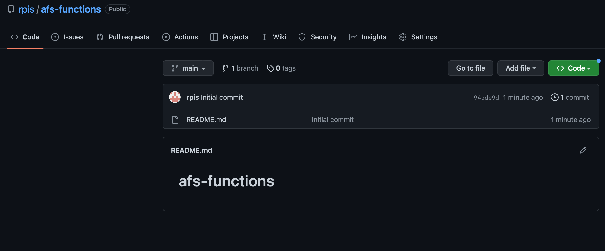
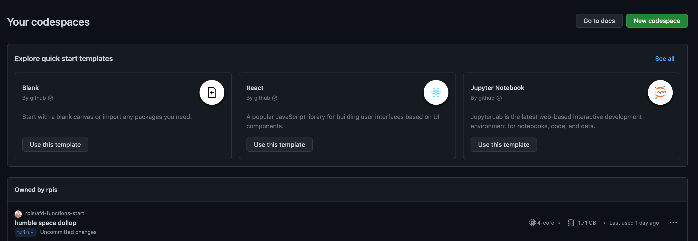
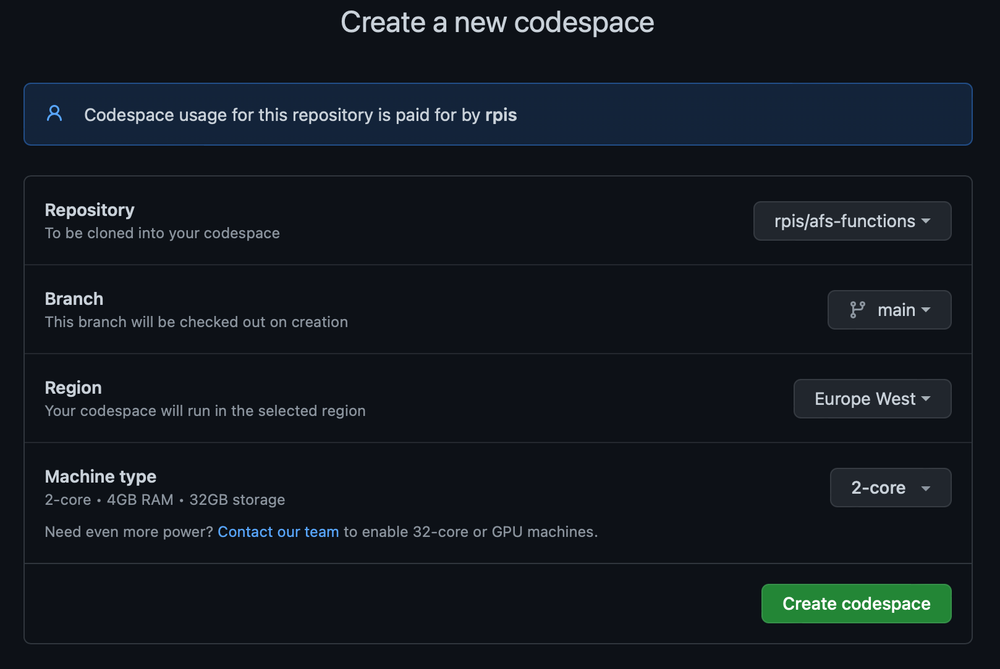

***Środowisko powinno zostac skonfigurowane dla każdej grupy ćwiczeń , gdy zaczynamy pracę***

---
## Założenie repozytorium w git
1. Otwórz konsole github i zaloguj się ([link](https://github.com))
2. Wybierz nowe repozytorium
3. Uzupełnij nazwę reppozytorium
4. Wybierz czy ma być widoczne publicznie czy prywatnie. Uwaga domyślnie tworzone jest repozytorium publiczne
5. Zaznacz "Add README file" - jest to istotne ze względu na utworzenie automatycznie brancha main
6. Potwierdź utworzenie repozytorium
   

Tym sposobem masz przygotowane repozytorium


---
## Uruchomienie codespaces dla utworzionego repo

1. Będąc w konsoli githuba wybierz "Codespaces" 
2. Wybierz "New Codespaces"
3. Wskaż utworzone wczeniej repozytorium, wybieramy branch - domyslnie main, ustawiamy region jak najbliższy geograficznie oraz zmieniamy typ maszyny na "2-core"  
4. POtwierdź wybór i po momencie środowsko jest dostępne

---
### Konfiguracja codespaces dla 
Pracuj na otwartym w przeglądarce środowisku
1. Otwórz terminal (Menu kabab w lewym rogu ekranu -> Terminal -> New terminal
2. Wykonaj instalację podsatwowych rozszerzeń (można to zrobić również ręcznie) 
    ```
        code --install-extension ms-vscode.vscode-node-azure-pack
        code --install-extension humao.rest-client
    ```
3. Zainstaluj core-tools dla azure
    ```
        sudo apt-get update
        sudo apt-get install azure-functions-core-tools-4
    ```
4. Zmień wersję node na 18 (azure core tools w tym momencie nie pracują na 19)
    ```
        nvm install 18
        nvm use 18
    ```
5. Sprawdz wersję node komendą node --version, powinna zostać pokazana v18.x

Twoje środowisko jest gotowe do pracy

Uwaga : Po każdym uruchomieniu środowiska należy wybrać wersję Node instrukcją "nvm use 18"