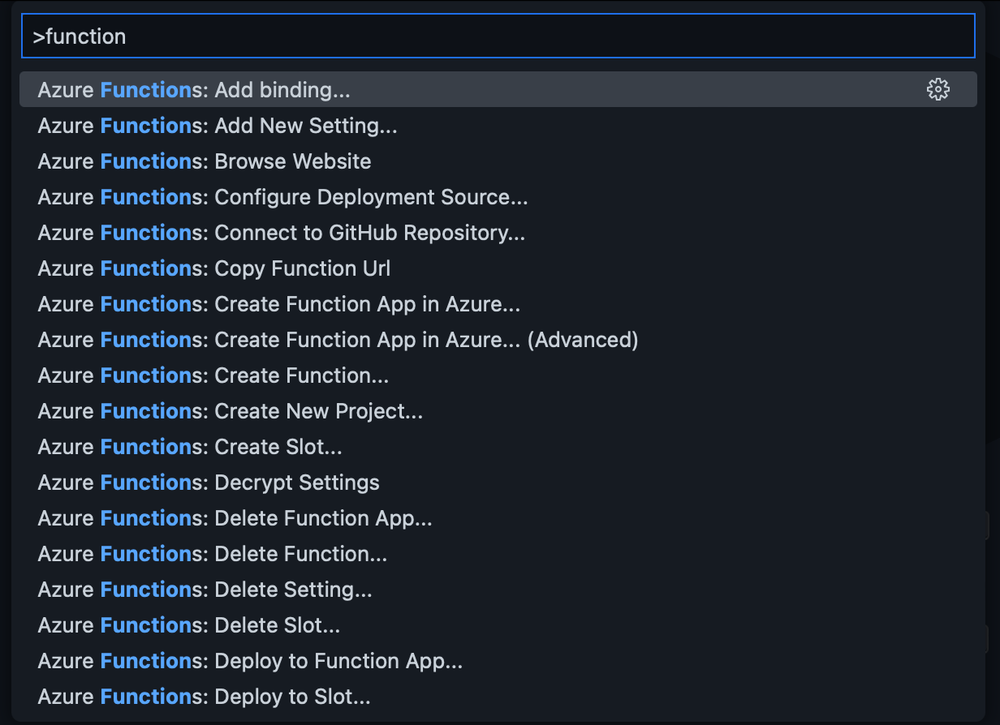
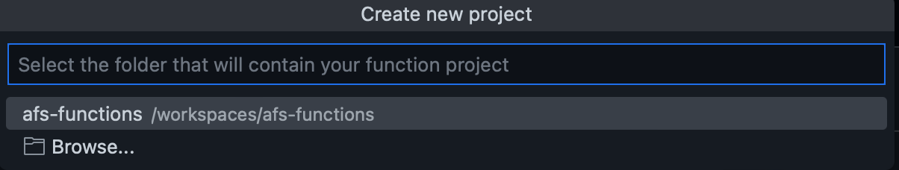
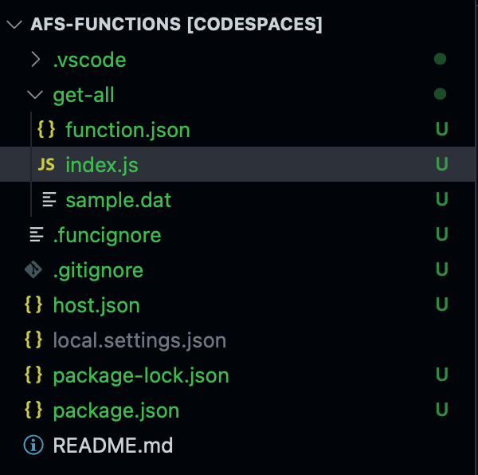
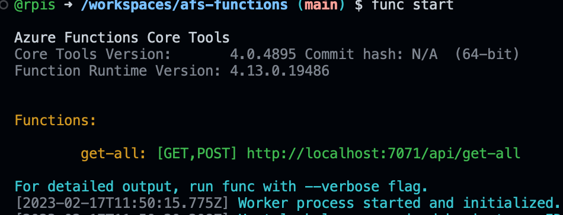
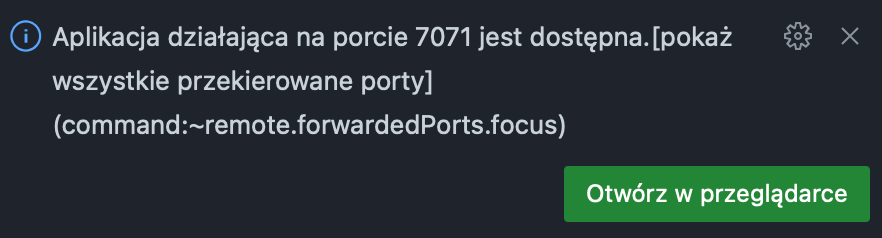
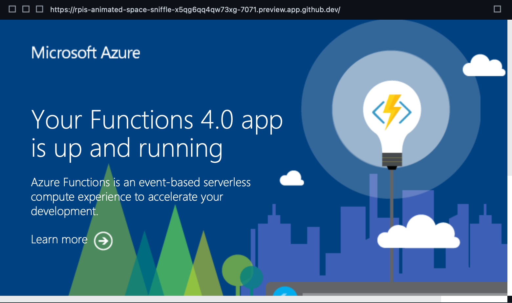
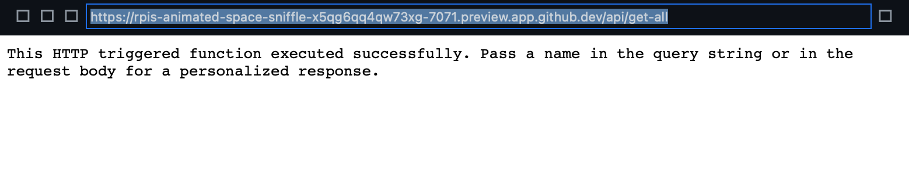
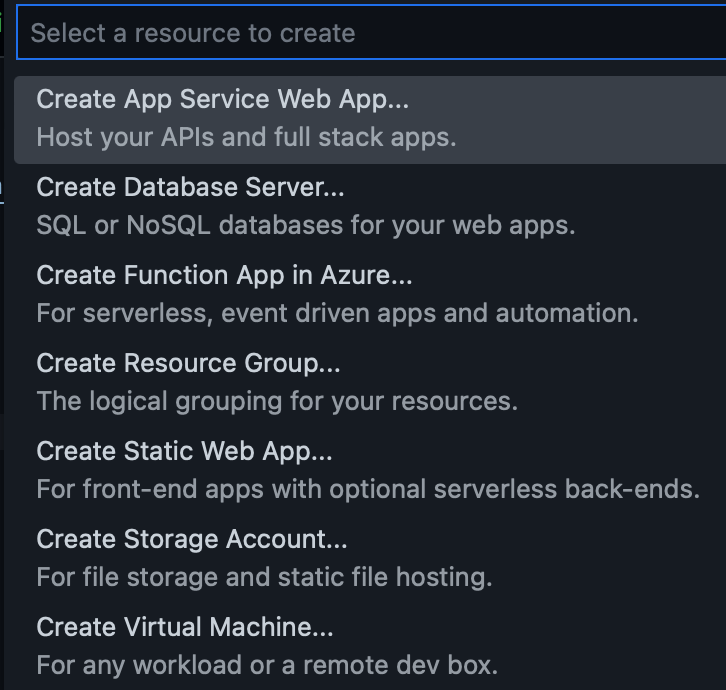
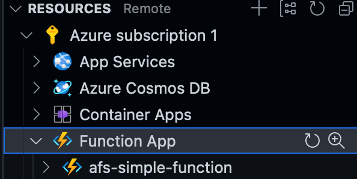

### Ćwiczenie 1 - uruchomienie prostej funkcji
1. Utwórz repozytorium oraz środowisko Codespaces do ćwiczeń związanych z funkcjami ([patrz](environment.md))
2. Mając uruchomione środowisko utworzymy w ramach naszego worskapce projekt funkcji
   1. Użyj skrótu ctrl-shift-p, zostanie wyświetlona paleta 
   2. Odfiltruj zadania dotyczące funcjji wpiskując func itp.
   3. Wybierz "Azure Function: create function"
   4. Wybierz aktualny katalog jako katalog tworzoneje funkcji 
   5. Wybierz język JavaSript
   6. Wybierz Http trigger jako template dla pierwszej tworzoenj funkcji
   7. Nazwij funkcje get-all (lub jak chcesz)
   8. Ustaw poziom autoryzacji jako Anonymous
   9. Po wykonaniu powyższych czynności zostanie uzupełniona zawartość projektu 

3. Otwórz plik index.js z katalogu get-all (lub innego odpwiadającego nazwie Twojej funkcji). Została stworzona podstawowa funkcja
   ```
        module.exports = async function (context, req) {
            context.log('JavaScript HTTP trigger function processed a request.');

            const name = (req.query.name || (req.body && req.body.name));
            const responseMessage = name
                ? "Hello, " + name + ". This HTTP triggered function executed successfully."
                : "This HTTP triggered function executed successfully. Pass a name in the query string or in the request body for a personalized response.";

            context.res = {
                // status: 200, /* Defaults to 200 */
                body: responseMessage
            };
    }
   ```
   
        Nie robi ona za wiele, ale posłuży nam do uruchomienia lokalnie

4. Uruchomienie lokalne (w rodowisku codespaces) funkcji:
    1. Otwórz terminal
    2. Wydaj polecenie:
 
        ``` 
            func start
        ``` 

    3. Po uruchomieniu powinien zostać wyświetlony komunikat 
    4. Zostaniemy również poinformowani o wystawieniu nowego portu: 
    5. Możemy zobaczyć adresy i porty na których działa nasz aplikacja na zakładce "Porty" 
    6. Na powyższej zakładce, gdy najedziemy na adres lokalny możemy uruchomić przeglądarkę w środowisku (symbol otwarcia w edytorze), lub w osobnej zakładce (symbol weba - globus)
    7. Po otwarciu w edytorze zobaczymy komunikat domyslny o uruchomionej funkcji 
    8. Dodaj w adresie przeglądarki na koncu /api/get-all (mój adres ma postać : https://rpis-animated-space-sniffle-x5qg6qq4qw73xg-7071.preview.app.github.dev/api/get-all
    9. Po wywoałaniu widzimy odpowiedź wykonanej funkcji 
    10. Możemy również wywołać tak https://rpis-animated-space-sniffle-x5qg6qq4qw73xg-7071.preview.app.github.dev/api/get-all?name=Anna, zobacz samodzielnie co się stanie
    11. Użycie rest-client - aby sprawdzać działanie api w środowisku dostępny jest rozszerzenie do tego, użyjemy jego
        1.  Utwórz w glównym katalogu plik req.http (ustaw sie gdzieś w glównym katalogu i wybierz dodaj plik)
        2.  Otwórz plik
        3.  Wklej do pliku wywołanmie własnej funkcji, w moim przypadku to:
            ```
                get http://localhost:7071/api/get-all?name=Anna
            ```
        4. Pojawił się również "Send request" ponad naszym get ...
        5. Kliknij "Send request"
        6. Powinno się pojawić dodatkowe okno z wynikiem wywołanmia podobnym do tego co uzyskaliśmy w przeglądarce
        7. Hint: możesz podać bazowy url i nie kopiować w następnych wywolaniach:
            ```

                @baseUrl = http://localhost:7071/api

                get {{baseUrl}}/get-all?name=Anna

            ```
    12. Deployment na azure
        1.  W menu kliknij na dodatku Azure (takie A...)
        2.  Wybierz "Sign in to Azure" i postępuj zgodnie ze wskazówkami (potwierdz otwórz najpierw i zaloguj się na swoje konto azurowe)
        3.  Rozwiń gałąż "Function App", powinna być pusta jeżeli nie masz swoim funkcji
        4.  Kliknij "+" pokazany przy "Resources", stworzymy funkcję ze środowsika
            1.  Wybierz "Create Function app ..." 
            2.  Nazwij swoją funkcję - nazwa musi być globalnie unikalna
            3.  Wybierz środowisko Node.js 18 LTS
            4.  Wybierz lokalizację, gdzie będzie funkcja uruchamiana i nastąpi tworzenie funkcji
            5.  Po utworzeniu funcja jest widoczna w przglądarce 
        5. Kliknij na swoje funkcji i z menu wybierz "Deploy to function App", potwierdz deployment i w terminalu obserwuj działanie. Oczekuij na komunikat o skończonym deploymencie
        6. Znajdz adres swojej funckji i korzytając z rest client wywołaj swoją funckję z azure, możesz zmienić swój plik req.http według wzoru, podając znaleziony adres (nie zapomnij o api na koncu adresu)
            ```
                #@baseUrl = http://localhost:7071/api
                @baseUrl = https://afs-simple-function.azurewebsites.net/api

                get {{baseUrl}}/get-all?name=Anna

            ```
    13. Zmień kod dla get-all ...
        1.  Zmień kod w pliku index.js na:
            ```
                const response = [{
                    "id": 1,
                    "name": "John Doe",
                    "email": "john.doe@wp.pl"
                },{
                    "id": 2,
                    "name": "Katerina Pavelkova",
                    "email": "k.pav@nevi.cz"
                }]

                module.exports = async function (context, req) {
                    context.log('JavaScript HTTP trigger function processed a request.');
                    context.log('Response: ' + response);
                    context.res = {
                        status: 200, /* Defaults to 200 */
                        body: response
                    }; 
                }
            ```
        2. Uruchom funkcję lokalnie i sprawdz działanie
        3. Uruchom funkcję w Azure
        4. Włacz logowanie na konsole z Azure i zobacz czy widzisz komunikat który masz w kodzie. Logowanie właczysz wybierając swoją funkcje i menu...
   
---