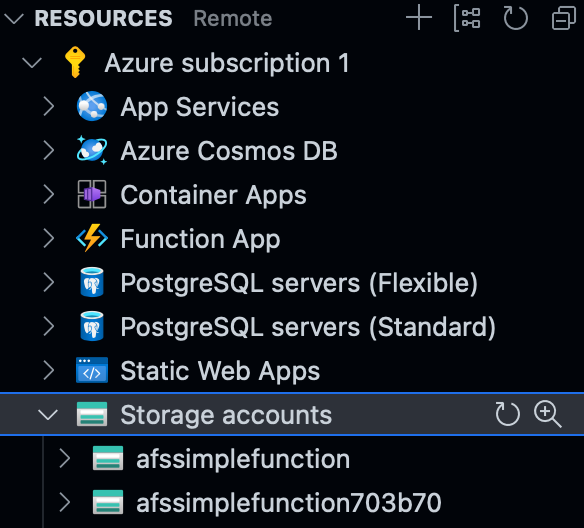
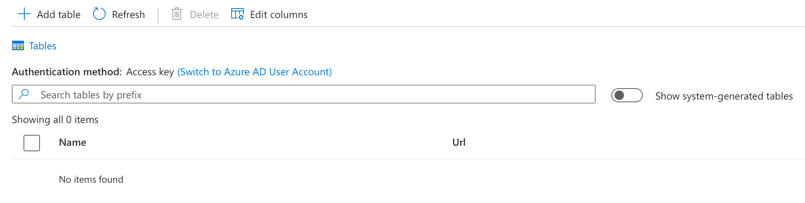
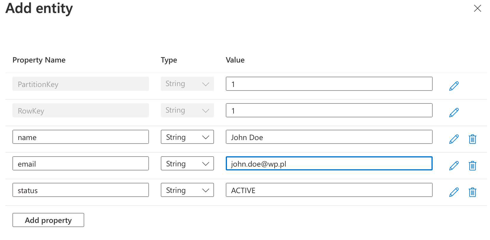

### Ćwiczenie 2 - funkcja i prosta baza danych

1. Utworzenie storage account
   1. Otwórz rozszerzenie dla azure
   2. Kliknij na "Storage accounts" i wybierz "Create new storege account"
   3. Wprowadz nazwę wybranaą przez Ciebie, pamiętaj że możesz używać tylko małych liter i numerów - nazwa musi być unikalna globalnie wiec możesz dodać swój prefiks (inicjały?)
   4. Wybierz lokalizację dla storage account i zatwierdz
   5. Po chwili zasób zostanie załozony i będzie widoczny na liście zasobów 
2. Zmiany w kodach
   1. Dodanie biblioteki - wykonaj instrukcję
   
    ```
     npm install @azure/data-tables
    ```
   2. Zmodyfikuj kod

    ```
        const { TableClient } = require("@azure/data-tables");

        const tableClient = new TableClient("YOUR_SAS_KEY!!!", "users");

        module.exports = async function (context, req) {
            context.log('JavaScript HTTP trigger function processed a request.');

            const entities = await tableClient.listEntities();
            var response = [];
            for await (const ent of entities) {
                response.push(ent);
            }
            context.res = {
                status: 200, /* Defaults to 200 */
                body: response
            }; 
        }
    ```
   3. Uzyskajmy SAS Key
       1. Zaloguj się/ przejdź do Azure
       2. Znajdź założony storage account
       3. W menu "Security + networking" otwórz "Shared access signature"
       4. Zostaw proponowane ustawienia zmieniając jedynie:
          1.  dodaj wszystkie w "Allowed resource types"
          2.  ustaw daty od do tak, żeby zawieraly następne parę godzin/dni/lat ... (zależy kto co liczy)
          3.  kliknij Generate
          4.  Skopiuj i  zapamietaj "Table service SAS URL"
   4. Wklej uzyskany klucz do kodu
   5. Uruchom naszą funcję wywołując "func start"
   6. Spróbuj wywołać funkcję
   7. Po wywołaniu w konsoli zobaczysz błąd

    ```
        [2023-02-19T21:11:59.600Z] Executed 'Functions.get-all' (Failed, Id=9a6a63a9-bd6e-4e75-88a3-f6804b237761, Duration=45ms)
        [2023-02-19T21:11:59.600Z] System.Private.CoreLib: Exception while executing function: Functions.get-all. System.Private.CoreLib: Result: Failure
        [2023-02-19T21:11:59.600Z] Exception: {"odata.error":{"code":"TableNotFound","message":{"lang":"en-US","value":"The table specified does not exist.\nRequestId:067148cb-e002-0014-6ca6-44a341000000\nTime:2023-02-19T21:11:59.5763885Z"}}}
        [2023-02-19T21:11:59.600Z] Stack: RestError: {"odata.error":{"code":"TableNotFound","message":{"lang":"en-US","value":"The table specified does not exist.\nRequestId:067148cb-e002-0014-6ca6-44a341000000\nTime:2023-02-19T21:11:59.5763885Z"}}}
        [2023-02-19T21:11:59.600Z]     at handleErrorResponse (/workspaces/afs-functions/node_modules/@azure/core-client/dist/index.js:1306:19)
        [2023-02-19T21:11:59.600Z]     at deserializeResponseBody (/workspaces/afs-functions/node_modules/@azure/core-client/dist/index.js:1241:45)
        [2023-02-19T21:11:59.600Z]     at process.processTicksAndRejections (node:internal/process/task_queues:95:5).
    ```
   8. Nie mamy założonej tablicy, wiec załóż z przykładową zawartości
      1. Przejdź do załozonego storage account
      2. Wybierz "Storage browser", nastepnie "Tables", uzyskasz widok 
      3. Wybierz Add table, nazywamy "users" i potwieerdź, Zostanie ona przedstawiona na liście
      4. Wybierz założoną tablice i zobaczysz pustą zawartość
      5. Wybierz "Add entity" i uzupełnij podobnie jak poniżej  i zatwierdź. Rekord zostanie przedstawiony na liście
   9. Wróć do Codespaces i sprawdź ponownie działanie funkcji. Powinno się uzyskać w odpowiedzi dane wprowadzone do bazy
   10. Wdróż na Azura i ponownie sprawdź
   11. Podawanie connection stringa w kodzie nie jest najlepszym pomysłem, zatem wynieś go do zmiennych środowiskowych
       1.  Zmień kod w podanym fragmencie

        ```
        ...
            const tableClient = new TableClient(process.env.TABLE_CONNECTION_STRING, "users");
        ...

        ```
    12. Ustaw zmienna środowiskowa w terminalu
        ```
            export TABLE_CONNECTION_STRING="YOUR_SAS_KEY"
        ```
    13. Sprawdz czy nie zapsuleś
    14. Wdrożenie na Azure musisz zacząc od ustwienia zmiennej środowiskowej w funkcji
        1.  Znajdz swoją funkcję w zasobach prezentowanych w rozszerzeniu do Azure
        2.  Rozwiń i wybierz "Application Settings"
        3.  Dodaj nową zmienna o nazwie TABLE_CONNECTION_STRING, zawierającą klucz SAS (tym razem bez "")
        4.  Wdróż i sprawdz działanie
    15. Stwórz funkcję obsługującą tworzenie nowego użytkownika
        1. Otwórz palate i znajdz "Create Function" -> poszukaj po słowie kluczowym i wybierz tę funkcję
        2. Wybierz "Http trigger", nazwij "post-one" i wybierz uwierzytelnianie anonimowe. Zostanie utworzona nowa funkcja
        3. Zmień kod w pliku index.js (dla utorzonej funkcji) na poniższy, zapewniający zapis nowego rekordu do bazy
            
            ```
                const { TableClient } = require("@azure/data-tables");

                const tableClient = new TableClient(process.env.TABLE_CONNECTION_STRING, "users");

                module.exports = async function (context, req) {
                    context.log('JavaScript HTTP trigger function processed a request.');

                    context.log(req.body);
                    try {
                        const entity = await tableClient.createEntity({
                            partitionKey: req.body.id,
                            rowKey: req.body.id,
                            name: req.body.name,
                            email: req.body.email,
                            status: "INACTIVE"
                        });
                        context.res = {
                            status: 201,
                            body: entity
                        };
                    } catch (e) {
                        context.res = {
                            status: 400,
                            body: e
                        };

                    }
                }
            ```
        4. Zmień ustawienia funcji aby akceptowała tylko post (w pliku function.json):
        ```
                {
                "bindings": [
                    {
                    "authLevel": "anonymous",
                    "type": "httpTrigger",
                    "direction": "in",
                    "name": "req",
                    "methods": [
                        "post"
                    ]
                    },
                    {
                    "type": "http",
                    "direction": "out",
                    "name": "res"
                    }
                ]
                }
        ```

        5. Uruchom lokalnie projekt i używając poniższego wywołania (plik req.http) sprawdz działanie
            ```
                ###
                post { {baseUrl} }/post-one

                {
                    "id": "2",
                    "name": "Irina Pavelkowa",
                    "email": "ip@cz.cz"
                }
            ```
    16. Zmień nasze endpoiny, definiując route:
        1.  Dla funkcji get-all, jak poniżej:
            ```
                {
                "bindings": [
                    {
                    "authLevel": "anonymous",
                    "type": "httpTrigger",
                    "direction": "in",
                    "name": "req",
                    "route": "user",
                    "methods": [
                        "get"
                    ]
                    },
                    {
                    "type": "http",
                    "direction": "out",
                    "name": "res"
                    }
                ]
                }
            ```
        2. Dla funkcji post-one, jak poniżej:
            ```
                {
                "bindings": [
                    {
                    "authLevel": "anonymous",
                    "type": "httpTrigger",
                    "direction": "in",
                    "name": "req",
                    "route": "user",
                    "methods": [
                        "post"
                    ]
                    },
                    {
                    "type": "http",
                    "direction": "out",
                    "name": "res"
                    }
                ]
                }
            ```
        3. Zmienily się nam automatycznie uri naszych funkcji, teraz w req.http inaczej je zdefiniuj
            ```

            @baseUrl = http://localhost:7071/api
            #@baseUrl = https://afs-simple-function.azurewebsites.net/api

            get { {baseUrl} }/user


            ###
            post { {baseUrl} }/user

            {
                "id": "2",
                "name": "Irina Pavelkowa",
                "email": "ip@cz.cz"
            }
            ```

    16. [Opcjonalne] Dodaj funkcje pobierającą pojedyńczy rekord z bazy po id
        1.  Utwórz nową funkcję nazywając ja "get-one"
        2.  Dodej kod:
            ```
                const { TableClient } = require("@azure/data-tables");

                const tableClient = new TableClient(process.env.TABLE_CONNECTION_STRING, "users");

                module.exports = async function (context, req) {
                    context.log('JavaScript HTTP trigger function processed a request.');

                    const entity = await tableClient.getEntity(req.params.id, req.params.id);
                    context.res = {
                        // status: 200, /* Defaults to 200 */
                        body: entity
                    };
                }
            ```
        3. Ogranicz działanie jedynie do get, oraz zdefiniuj routing jak poniżej:
           ```
              "route": "user/{id}",
            ```
        4. Sprawdz działanie wykorzystując wywołanie:
            ```
                ###
                get { {baseUrl} }/user/1
            ```
        5. Wdróż na azure i sprawdz działanie.
    

---