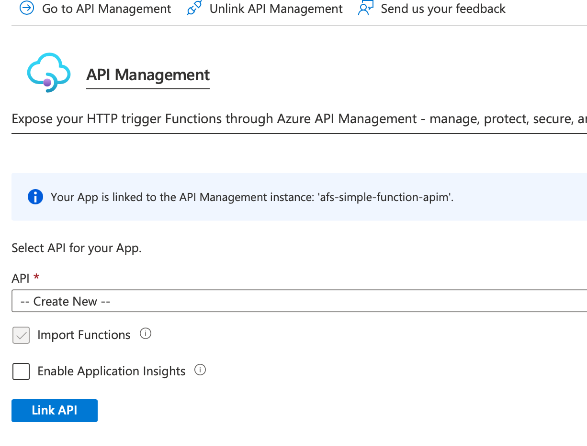
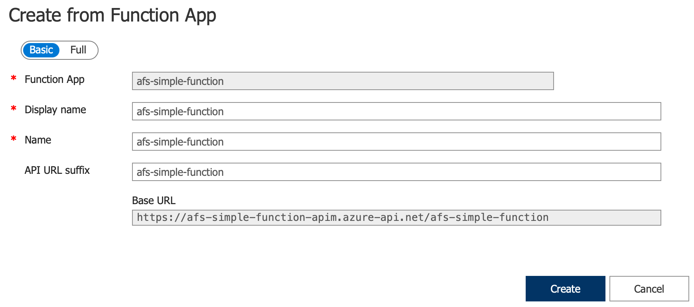

### Cwicenie 4 - użycie API-GW

1. Wybieramy utworzoną funkcję w portalu Azure i przechodzimy do menu "Api Management"
2. Możemy wybrać istniejący już komponent albo utworzyć nowy, tworzymy nowy
   1. Wybieramy region, nadajemy nazwe, ustalamy workspace nam na dowolną nazwę i wpisujemy email
   2. Wybieramy (nie zmieniamy) Pricing tier. Powinien dla naszych celów być "Consumption" 
   3. Przechodzimy dalej, odznaczamy Application Insights i potwierdzamy "Review and create" i ponownie "Create"
   4. Po momencie zostanie założona instancja apim
   5. Na zakładce w API Management w naszej funkcji zostanie pokazana zakładka wyboru API, klikamy "Link API" 
   6. Zostanie przedstawiony wybór funcji do wystawienia jako api 
   7. Potwierdzamy i zobaczymy widok 
   8. Zatwierdzamy i zobaczymy utworzone api 
   9. Odznacz set subsription required na zakładce Settings  
   10. Otwórz codespaces utworzony dla funcji i przetestuj działanie używając swojego adresu api managementu
   11. Dodanie zabezpieczenia funcji (nie chcemy, żeby poza apim była wołana...)
       1.  Uruchom środowisko Codespace dla funkcji
       2.  Zmień aktualny authLevel z anonymous na function dla 3 utworzonych funkcji (pliki function.json)
       3.  Wdróż funkcję
       4.  Sprawdz, że wywołanioa którymi testowalismy bezpośrednio funkcję zwaracają błąd 401 (jak nie zwracają to coś jest nie tak)
       5.  Sprawdz wywołania przez apim, oczekujemy poprawnych wywołań
   

---

