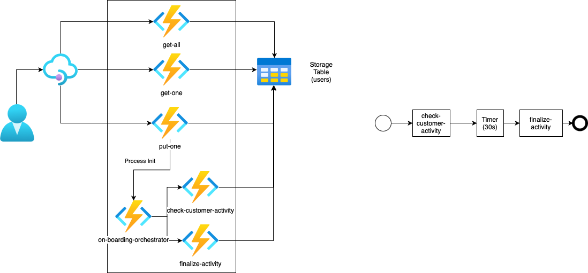
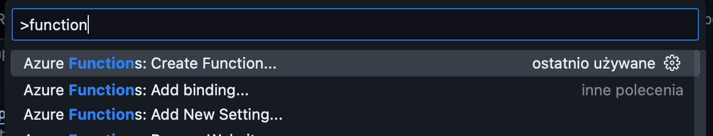
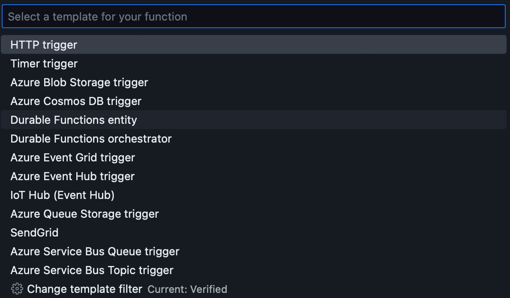
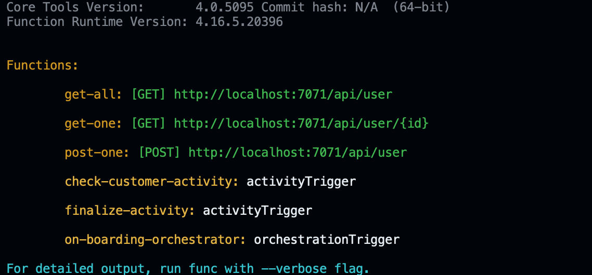

### Ćwiczenie 5 - Durable functions

Zakres ćwiczenia:
- dodamy funkcjonalność procesu do projektu funkcji jak na diagramie poniżej




1. Otwórz paletę (Shoft+Cmd+P) i wybieramy "Cretae Function"
   
2. Wybierz "Durable Functions orchestrator"
   
3. Potwierdź wybór "Azure Storage" jako miejsca składowania procesów
4. Nazwij swoją funkcję "on-boarding-orchestrator"
5. Powstał kod naszego orkiestratora, przejrzyj plik index.js w katalogu "on-boarding-orchestrator"
6. Utwórz kolejną funkcję, tym razem "Durable Functions activity", nazywając ją "check-customer-activity"
7. I utwórz następną funkcję "Durable Functions activity", nazywając ją "finalize-activity"
8. Dodaj wymaganą bibliotekę instrukcją:
   ```
        npm install durable-functions
   ```
9.  Zmień kod orkiestratora procesu na:
   ```
       const df = require("durable-functions");
       module.exports = df.orchestrator(function* (context) {
           const outputs = [];
           outputs.push(yield context.df.callActivity("check-customer-activity", "Anna"));
           outputs.push(yield context.df.callActivity("finalize-activity", "Anna"));
           return outputs;
       });
   ```
10. Zmień plik host.json, ustawiając w extension nazwe polaczenia do storage wykorzytywnego dla durable functions (jest to etykieta!)
    ```
        "extensions": {
            "durableTask": {
            "storageProvider": {
                "connectionName":  "AzureWebJobsStorage"
            }
            }
        }
    ```
11. Utwórz plik konfiguracji lokalnej local.settings.json (w głównym katalogu projektu) z zawartością definiującą adres storage:
    ```
        {
            "IsEncrypted": false,
            "Values": {
            "AzureWebJobsStorage": "YOUR_CONNECTION_STRING",
            "FUNCTIONS_WORKER_RUNTIME": "node"
            }
        }
    ```
12. Dodaj do funkcji post-one inicjowanie procesu (dodane const df oraz kod od const client = df.getClient(context); ):
    ```
        const { TableClient } = require("@azure/data-tables");
        const { DefaultAzureCredential } = require("@azure/identity");
        const df = require("durable-functions");

        const tableClient = new TableClient(process.env.TABLE_CONNECTION_STRING, "users",
            new DefaultAzureCredential());

        module.exports = async function (context, req) {
            context.log('JavaScript HTTP trigger function processed a request.');

            context.log(req.body);
            try {
                const entity = await tableClient.createEntity({
                    partitionKey: req.body.id,
                    rowKey: req.body.id,
                    name: req.body.name,
                    email: req.body.email,
                    status: "INACTIVE"
                });
                const client = df.getClient(context);
                const body = {
                id: req.body.id,
                };
                const instanceId = await client.startNew(
                'on-boarding-orchestrator',
                undefined,
                body,
                );
                console.log("Process started! id = " + instanceId)
                context.res = {
                    status: 201,
                    body: entity
                };
            } catch (e) {
                console.log(e);
                context.res = {
                    status: 400,
                    body: e
                };

            }
        }
    ```
13. Aby móc wywołać start procesu dodaj do bindingów funkcji post-one następujący binding:
    ```
    {
      "name": "starter",
      "type": "orchestrationClient",
      "direction": "in"
    }
    ```
14. Uruchom funkcję, startując wyświetlone zostają funkcję w projekcie:
     

15. Wywołaj metode POST /users (funkcja post-one), powinieneś w logu zobaczyc komunikaty związane z wywoływaniem procesu:
    ```
        [2023-04-18T09:25:37.640Z] Executing 'Functions.post-one' (Reason='This function was programmatically called via the host APIs.', Id=773c6ee1-24da-4f87-892a-8073fe100878)
        [2023-04-18T09:25:37.645Z] JavaScript HTTP trigger function processed a request.
        [2023-04-18T09:25:37.645Z] { id: '13', name: 'Irina Pavelkowa', email: 'ip@cz.cz' }
        [2023-04-18T09:25:37.922Z] Process started! id = e7c89078b7704a13b16b1774201c50bc
        [2023-04-18T09:25:37.926Z] Executed 'Functions.post-one' (Succeeded, Id=773c6ee1-24da-4f87-892a-8073fe100878, Duration=286ms)
        [2023-04-18T09:25:38.055Z] Executing 'Functions.on-boarding-orchestrator' (Reason='(null)', Id=e4df1465-2dd6-415c-b737-02ac51fdee8d)
        [2023-04-18T09:25:38.099Z] Executed 'Functions.on-boarding-orchestrator' (Succeeded, Id=e4df1465-2dd6-415c-b737-02ac51fdee8d, Duration=49ms)
        [2023-04-18T09:25:38.174Z] Executing 'Functions.check-customer-activity' (Reason='(null)', Id=ba274ecd-44c9-492f-bfed-0111253728f2)
        [2023-04-18T09:25:38.178Z] Executed 'Functions.check-customer-activity' (Succeeded, Id=ba274ecd-44c9-492f-bfed-0111253728f2, Duration=6ms)
        [2023-04-18T09:25:38.344Z] Executing 'Functions.on-boarding-orchestrator' (Reason='(null)', Id=9065454f-ff4c-4a8b-9e41-9c1c563bb259)
        [2023-04-18T09:25:38.358Z] Executed 'Functions.on-boarding-orchestrator' (Succeeded, Id=9065454f-ff4c-4a8b-9e41-9c1c563bb259, Duration=16ms)
        [2023-04-18T09:25:38.405Z] Executing 'Functions.finalize-activity' (Reason='(null)', Id=0f3258bc-fe9e-423b-a9fa-3bb68661d163)
        [2023-04-18T09:25:38.412Z] Executed 'Functions.finalize-activity' (Succeeded, Id=0f3258bc-fe9e-423b-a9fa-3bb68661d163, Duration=7ms)
        [2023-04-18T09:25:38.518Z] Executing 'Functions.on-boarding-orchestrator' (Reason='(null)', Id=046e4ce4-0e60-4083-8b0d-a594390263e3)
        [2023-04-18T09:25:38.525Z] Executed 'Functions.on-boarding-orchestrator' (Succeeded, Id=046e4ce4-0e60-4083-8b0d-a594390263e3, Duration=7ms)
    ```
16. Uzyskalismy działający proces, chociaż jeszcze nic nie robi :)
17. Zmień kod orkiestratora aby przekazywac parametry do activity oraz symulowa dłuższy czas pracy:
    ```
        const df = require("durable-functions");
        const moment = require('moment');

        module.exports = df.orchestrator(function* (context) {
            const outputs = [];
            outputs.push(yield context.df.callActivity("check-customer-activity",context.df.getInput()));
            
            console.log('Timer start');
            const nextCheck = moment.utc(context.df.currentUtcDateTime).add(30, 's');
            yield context.df.createTimer(nextCheck.toDate());
            console.log('Timer end');
            
            outputs.push(yield context.df.callActivity("finalize-activity", context.df.getInput()));
            return outputs;
        });
    ```

18. Zmień kod check-customer-activity:
    ```
        const { TableClient } = require("@azure/data-tables");
        const { DefaultAzureCredential } = require("@azure/identity");

        const tableClient = new TableClient(process.env.TABLE_CONNECTION_STRING, "users",
            new DefaultAzureCredential());


        module.exports = async function (context) {
            console.log("Processing id:"+context.bindings.name.id);
            var entity = await tableClient.getEntity(context.bindings.name.id,context.bindings.name.id);
            entity.status = "IN_PROGRESS"
            await tableClient.updateEntity(entity);
            return "In progress executed";
        };
    ```
20. Na podobnej zasadzie zmień kod finalize-activity:
    ```
        const { TableClient } = require("@azure/data-tables");
        const { DefaultAzureCredential } = require("@azure/identity");

        const tableClient = new TableClient(process.env.TABLE_CONNECTION_STRING, "users",
            new DefaultAzureCredential());


        module.exports = async function (context) {
            console.log("Processing id:"+context.bindings.name.id);
            var entity = await tableClient.getEntity(context.bindings.name.id,context.bindings.name.id);
            entity.status = "ACTIVE"
            await tableClient.updateEntity(entity);
            return "Finalize executed";
        };
    ```

21. Przetestuj dzialanie funkcji i procesu.
22. Zobacz dzialanie funcji "administracyjnych", startowanie procesu oraz sprawdzanie statusu:
    ```
        post http://localhost:7071/runtime/webhooks/durabletask/orchestrators/on-boarding-orchestrator/

        {
            "id": "7"
        }

        ###

        get http://localhost:7071/runtime/webhooks/durabletask/instances/

    ```
23. Uruchom w Azure, zobacz jak wyglądają zmienne konfiguracyjne oraz spróbuj przetestować działanie.


---
