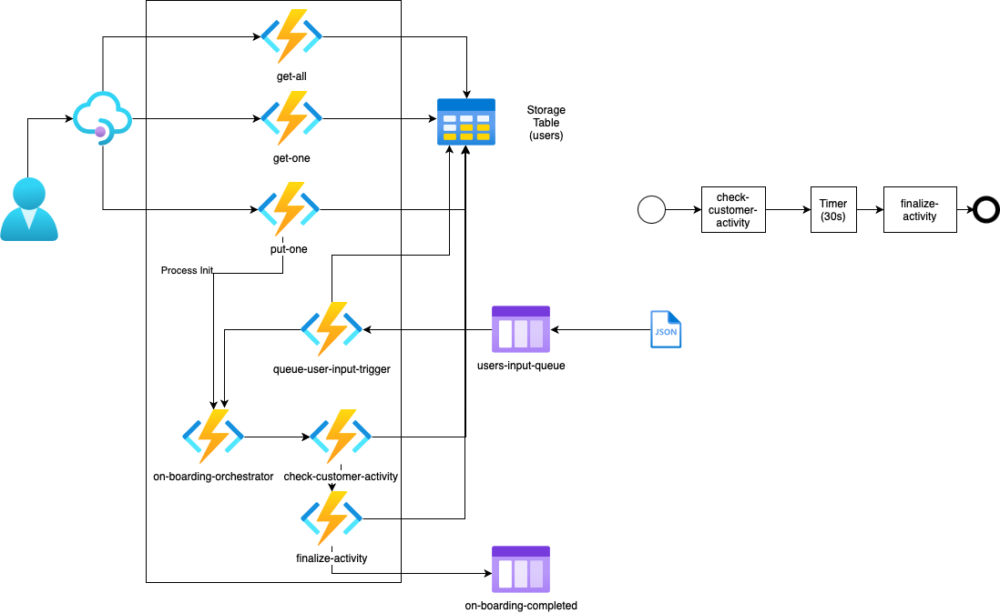

### Ćwiczenie 6 - stoerage queue


Zakres ćwiczenia:
- dodamy obsługę kolejek do projektu




1. Utwórz nową funkcję, tym razem wybierjąc "Azure Queue Storage trigger"
2. Nazwij ją "queue-user-input-trigger"
3. Wybierz zdefiniowaną wcześniej lokalizację AzureWebJobsStorage
4. Nazwij kolejkę z której będziemy korzytali "users-input"
5. Zostanie następnie utworzona funkcja z kodem jedynie logującym dane wejściowe
6. Przetestuj dzialanie:
   1. Uruchom funkcję
   2. W "Portalu Azure" znajdz podpięty storage account i przejdź do "Queues"
   3. Zalóż kolejkę o nazie "users-input"
   4. Wyślij testową wiadomoś do kolejki (dowolną)
   5. Treś wiadomości zobaczysz w logach funkcji
7. Zmień kod funkcji queue-user-input-trigger na:
    ```
        const { TableClient } = require("@azure/data-tables");
        const { DefaultAzureCredential } = require("@azure/identity");
        const df = require("durable-functions");

        const tableClient = new TableClient(process.env.TABLE_CONNECTION_STRING, "users",
            new DefaultAzureCredential());

        module.exports = async function (context, myQueueItem) {
            context.log('JavaScript queue trigger function processed work item', myQueueItem);

            try {
                const entity = await tableClient.createEntity({
                    partitionKey: myQueueItem.id,
                    rowKey: myQueueItem.id,
                    name: myQueueItem.name,
                    email: myQueueItem.email,
                    status: "INACTIVE"
                });
                const client = df.getClient(context);
                const body = {
                id: myQueueItem.id,
                };
                const instanceId = await client.startNew(
                'on-boarding-orchestrator',
                undefined,
                body,
                );
                console.log("Process started! id = " + instanceId)
            } catch (e) {
                console.log(e);
            };

        };
    ```
8. Dodaj binding dla staru procesu:
   ```
        {
        "name": "starter",
        "type": "orchestrationClient",
        "direction": "in"
        }

   ```
9. Uruchom funkcję
10. Prześlij wiadomośc do kolejki w postaci body z usługi restowej post-one
11. Sprawdz czy został wywołany zapis, proces, zobacz w bazie czy pojawiła się encja
12. Dodaj powiadomienia na kolejce o zakończeniu procesowania
    1.  Z palety wybierz "Azure Function: add binding"
    2.  Wybierz projekt lokalny
    3.  Wybierz funckje "finalize-activity"
    4.  Ustal typ bindingu out
    5.  Wybierz Azure Queue Storage
    6.  Pozostaw prroponowaną nazwę "outputQueueItem" dla zmiennej bindingu
    7.  Ustaw nazwe kolejki "on-boarding-completed"
    8.  Wybierz połączenie do storage definiowane przez "AzureWebJobsStorage"
    9.  Zmień kod funckji "finalize-activity" na:
        ```
            const { TableClient } = require("@azure/data-tables");
            const { DefaultAzureCredential } = require("@azure/identity");

            const tableClient = new TableClient(process.env.TABLE_CONNECTION_STRING, "users",
                new DefaultAzureCredential());


            module.exports = async function (context) {
                console.log("Processing id:"+context.bindings.name.id);
                var entity = await tableClient.getEntity(context.bindings.name.id,context.bindings.name.id);
                entity.status = "ACTIVE"
                await tableClient.updateEntity(entity); 
                context.bindings.outputQueueItem = JSON.stringify(entity);
                return "Finalize executed";
            };
        ```
    10. Uruchom funkcję, zalóż postem lub poprzez kolejkę użytkownika i sprawdz czy pojawiła się wiadomość w kolejce "on-boarding-completed"
    

